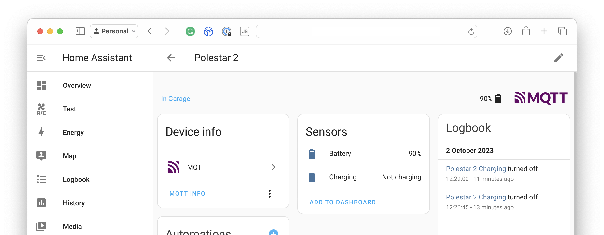

# tibberevmqtt

This is a small integration to load EV status from Tibber and publish it to
MQTT. The result is state-of-charge data in, for example, Home Assistant.
Taking this data from Tibber is useful because it acts as an intermediate
layer towards several different car vendors, some of which don't have an
(open) API of their own; e.g., Polestar.

Doing it via MQTT provides automatic discovery. Multiple vehicles per
account are supported.

## Usage

```
Usage: tibberevmqtt

Flags:
  -h, --help                                  Show context-sensitive help.
      --mqtt-broker="tcp://localhost:1883"    MQTT broker address ($MQTT_BROKER)
      --mqtt-username=""                      MQTT username ($MQTT_USERNAME)
      --mqtt-password=""                      MQTT password ($MQTT_PASSWORD)
      --tibber-username=""                    Tibber username ($TIBBER_USERNAME)
      --tibber-password=""                    Tibber password ($TIBBER_PASSWORD)
      --refresh-interval=2m                   Refresh interval ($REFRESH_INTERVAL)
```

## Screenshot


